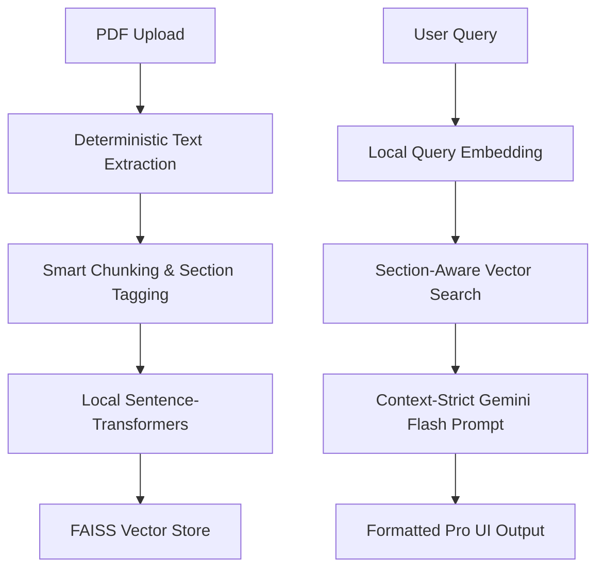

# 📄 Research Paper Analyzer - Gemini RAG System


An intelligent, professional-grade Research Assistant that uses **Retrieval-Augmented Generation (RAG)** to analyze academic papers with human-like understanding. Built with a focus on speed, precision, and a premium user experience.


---

## ✨ Key Features

- 🧠 **Smart Context Retrieval**: Uses local **Sentence-Transformers** for embedding and **FAISS** for millisecond-fast vector search.
- 🎯 **Section-Aware Intelligence**: Prioritizes `Abstract`, `Introduction`, and `Conclusion` for overview questions to ensure contextually relevant answers.
- 💬 **Professional UI**: A premium, single-page chat interface with:
  - **Markdown Rendering**: (Bold text, Headers, Lists)
  - **Source Citations**: Beautiful pill-badges showing which sections provided the answer.
  - **Smooth Animations**: Glassmorphism aesthetic and refined view transitions.
- ⚡ **Zero-API-Cost Embeddings**: All vector operations are performed locally, saving you Gemini API tokens.
- 🛡️ **Robust Engineering**: Implements exponential backoff for rate-limiting (429 errors) and strict context-only generation to prevent hallucinations.

---

## 🚀 Getting Started

### 1. Clone the Repository
```bash
git clone https://github.com/Sridattasai18/Research-Paper-Analyzer.git
cd Research-Paper-Analyzer
```

### 2. Set Up Virtual Environment
```bash
python -m venv venv
# Windows:
.\venv\Scripts\activate
# Linux/Mac:
source venv/bin/activate
```

### 3. Install Dependencies
```bash
pip install -r requirements.txt
```

### 4. Configuration
Create a `.env` file in the root directory and add your Gemini API Key:
```env
GEMINI_API_KEY=your_actual_key_here
```
> [!IMPORTANT]
> Get your free API key at [Google AI Studio](https://aistudio.google.com/).

---

## 🛠️ Usage

1. **Start the Server**:
   ```bash
   python app.py
   ```
2. **Access the Web UI**: Open `http://localhost:5000` in your browser.
3. **Analyze**:
   - Drag and drop a research PDF.
   - Wait for the "Indexing complete" message (processed locally).
   - Ask anything! From "What are the main findings?" to "Explain the methodology."

---

## 🏗️ Technical Architecture



## 📁 Project Structure

```text
rag/
├── app.py                # Main Flask application entry point
├── config.py             # System-wide configuration and API setup
├── routes/
│   ├── ingestion.py      # PDF processing and indexing endpoints
│   └── query.py          # RAG query and debug endpoints
├── services/
│   ├── pdf_loader.py     # Advanced PDF text extraction
│   ├── chunker.py        # Smart text chunking with section detection
│   ├── embeddings.py     # Local vector generation (no API needed)
│   ├── vector_store.py   # FAISS vector management
│   └── rag_pipeline.py   # Orchestration of Retrieval + Gemini LLM
├── templates/
│   └── index.html        # Modern SPA Frontend
├── static/
│   ├── app.js            # Frontend logic & Markdown rendering
│   └── style.css         # Premium Glassmorphism UI styles
└── assets/               # Branding and visuals
```

---

## 🎓 Quality Gate Testing
The system is optimized to answer these effectively:
- "What dataset was used for evaluation?"
- "What are the core limitations identified by the authors?"
- "Summarize the proposed methodology in simple terms."

---

## 🤝 Contributing
Contributions are welcome! Feel free to open an issue or submit a pull request for UI improvements or advanced retrieval techniques.

---

## 📜 License
MIT License. Feel free to use this for your own research or portfolio projects!
